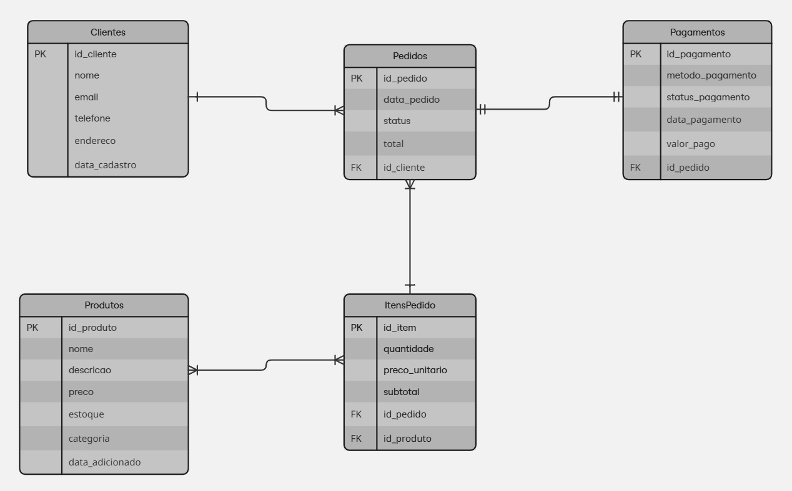

# SQL Comercial

Este projeto tem como objetivo centralizar e organizar scripts SQL utilizados em processos comerciais. Ele serve como repositório para consultas, procedimentos e rotinas que facilitam a análise e automação de tarefas relacionadas ao setor comercial.

## Modelo de Banco de Dados

As especificações detalhadas sobre as regras de negócio deste modelo encontram-se disponíveis na pasta `doc`.

### Diagrama do Modelo Lógico

Abaixo está o diagrama do modelo lógico, que ilustra como as tabelas do banco de dados estão conectadas e como ocorre o fluxo de informações entre elas:



#### 1. Tabelas de Auditoria

O projeto inclui tabelas de auditoria para registrar alterações realizadas nos dados comerciais. Essas tabelas armazenam informações como data/hora da modificação, usuário responsável, tipo de operação (inserção, atualização, exclusão) e os valores antigos e novos dos registros alterados.

As tabelas de auditoria são essenciais para garantir a rastreabilidade das operações, facilitar a identificação de inconsistências e apoiar processos de conformidade e governança de dados.

Exemplo de campos comuns em uma tabela de auditoria:

- `id_auditoria`: Identificador único do registro de auditoria
- `operacao`: Tipo de operação realizada (INSERT, UPDATE, DELETE)
- `registro_id`: Identificador do registro alterado
- `usuario`: Usuário responsável pela alteração
- `data_hora`: Data e hora da operação
- `valores_anteriores`: Dados antes da alteração
- `valores_novos`: Dados após a alteração

Essas tabelas permitem monitorar o histórico de mudanças e reforçam a segurança e integridade das informações no ambiente comercial.

#### 2. Triggers

Triggers são procedimentos armazenados no banco de dados que são executados automaticamente em resposta a eventos específicos, como inserções, atualizações ou exclusões de dados em tabelas. No contexto deste projeto, triggers são utilizadas principalmente para:

- Registrar alterações em tabelas comerciais nas tabelas de auditoria.
- Garantir a integridade dos dados ao aplicar regras de negócio automaticamente.
- Automatizar tarefas recorrentes, como atualização de campos derivados ou controle de logs.


## Funcionalidades

- Scripts para criação e manipulação do banco de dados
- Consultas para análise de vendas e desempenho
- Procedimentos para atualização de dados comerciais
- Automatização de registro de alterações


## Sobre os Dados Utilizados

Os dados presentes neste repositório foram gerados artificialmente por meio de ferramentas de Inteligência Artificial. Eles não correspondem a informações reais de clientes, empresas ou transações, sendo utilizados exclusivamente para fins de demonstração, testes e desenvolvimento dos scripts SQL.

## Conexão com o Banco de Dados

A conexão com o banco de dados é realizada utilizando strings de conexão padrão para o SGBD adotado (no caso desse projeto, o MySQL). Os scripts deste repositório assumem que as credenciais e parâmetros de acesso (host, usuário, senha, nome do banco) já estão configurados no ambiente de execução ou em arquivos de configuração específicos (.env).

Exemplo de string de conexão para SQL Server:

```sql
BD_HOST=SEU_SERVIDOR;
BD_NAME=NOME_DO_BANCO;
BD_USER=SEU_USUARIO;
BD_PASSWORD=SUA_SENHA;
```
No script Python, a conexão com o banco de dados foi utilizada para inserir os dados de todas as cinco tabelas em uma única operação, otimizando o processo e reduzindo o tempo de execução.

```
Arquivo localizado em:

    insert/
         insert_data.py
```
## Licença

```
Desenvolvimento e modelagem em 2025 por pedroryandatadev (Pedro Ryan)

Este projeto está licenciado sob a licença MIT. Consulte o arquivo LICENSE para obter mais informações.
```